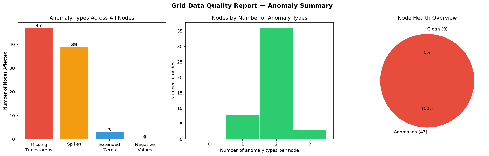
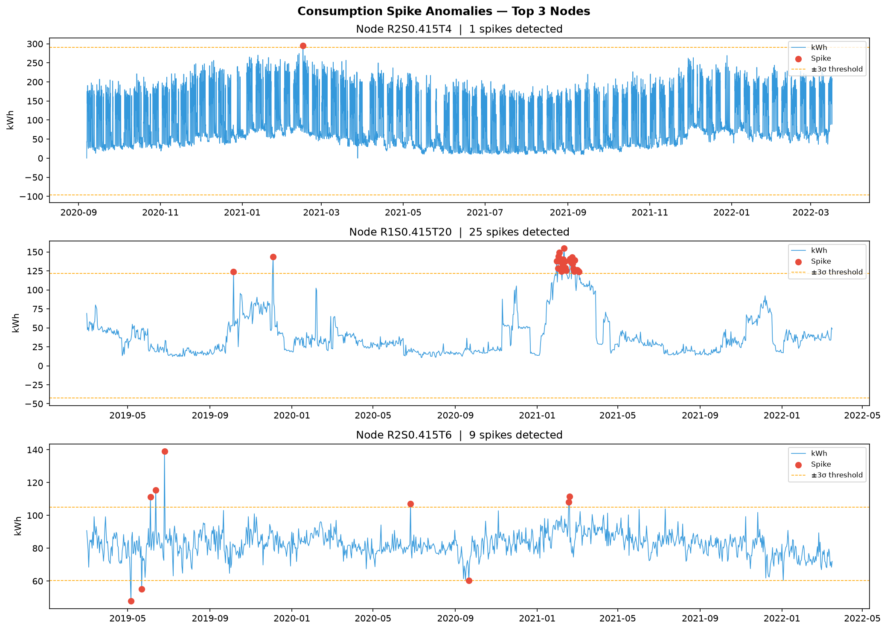
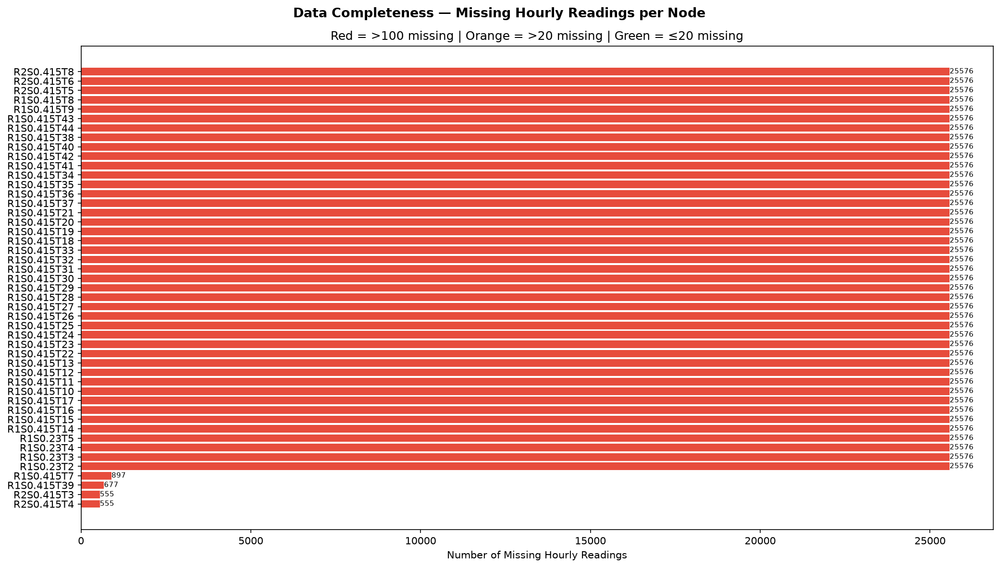

# Grid Data Integration Pipeline

**End-to-end data engineering pipeline for Norwegian distribution-grid consumption data.**

Ingests real hourly electricity consumption from 47 grid nodes (2019–2022), runs automated data quality checks, integrates live Norwegian open APIs, and delivers findings through an interactive dashboard.

> Built to demonstrate data engineering skills relevant to Norwegian grid digitalization — specifically for roles focused on data quality, system integrations, and digital development in the energy sector.

---

## Key findings

After running the full pipeline on 109,726 hourly records across 47 grid nodes:

| Finding | Result |
|---------|--------|
| Nodes analysed | 47 |
| Nodes with data quality issues | **47 / 47 (100%)** |
| Nodes with statistical spikes | **39 / 47 (83%)** |
| Nodes with missing timestamps | **47 / 47 (100%)** |
| Nodes with extended zero consumption | 3 / 47 |
| Missing hours range (per node) | 555 – 25,576 hours |
| Worst spike detected | **295.6 kWh** (node R2S0.415T4, vs. avg 240.6 kWh) |
| Peak total consumption | 3,850.7 kWh (all nodes, 1 June 2021 00:00) |
| Average hourly consumption | 240.6 kWh (all 47 nodes combined) |

**The 100% anomaly rate is not a sign of bad data — it reflects a real-world distribution grid**: nodes were added at different times (some have only 30 days of data, others have 3 full years), creating systematic timestamp gaps that a data quality pipeline must detect and document before any downstream analysis.

---

## Pipeline architecture

```
┌──────────────────────────────────────────────────────────────┐
│  A — DATA INGESTION & QUALITY                                │
│                                                              │
│  [Zenodo API] ──► download_zenodo.py                         │
│       47 nodes · 109,726 records · Mar 2019 – Mar 2022       │
│       Semicolon-delimited · Norwegian decimal commas         │
│                    │                                         │
│                    ▼                                         │
│            anomaly_detection.py                              │
│            ┌─────────────────────────────┐                   │
│            │ 1. Missing timestamps       │  47/47 nodes      │
│            │ 2. Statistical spikes       │  39/47 nodes      │
│            │    (Z-score > 3σ)           │  max 295.6 kWh    │
│            │ 3. Extended zeros (> 6h)    │   3/47 nodes      │
│            │ 4. Negative values          │   0/47 nodes      │
│            └────────────┬────────────────┘                   │
│                         ▼                                    │
│                 anomaly_report.json                          │
│                 report.html + figures                        │
└─────────────────────────┬────────────────────────────────────┘
                          │
┌─────────────────────────▼────────────────────────────────────┐
│  B — INTEGRATION LAYER                                       │
│                                                              │
│  [SSB Statistics Norway]     [MET Norway api.met.no]         │
│  National electricity         Hourly weather forecast        │
│  balance 2019–2022 (GWh)      Hønefoss / Ringerike           │
│  · Hydro production           · Temperature (°C)            │
│  · Wind production            · Wind speed (m/s)            │
│  · Imports / Exports          · Humidity, cloud cover        │
│  · Net consumption                    │                      │
│          │                            │                      │
│          └────────────┬───────────────┘                      │
│                       ▼                                      │
│              integrated_annual.csv                           │
│              hourly_consumption.csv                          │
│              weather_ringerike.csv                           │
└─────────────────────────┬────────────────────────────────────┘
                          │
┌─────────────────────────▼────────────────────────────────────┐
│  C — INTERACTIVE DASHBOARD                                   │
│  streamlit run scripts/dashboard.py                          │
│  · Consumption time series (hourly + monthly)               │
│  · Anomaly breakdown + per-node drill-down                   │
│  · National context (node GWh vs SSB national GWh)          │
│  · Live weather for Ringerike                                │
└──────────────────────────────────────────────────────────────┘
```

---

## Analysis results

### Data quality summary



Every single node had at least one data quality issue. The most common: **missing timestamps** (all 47 nodes) caused by staggered node deployment across the measurement period — some nodes have 3 years of data, others have only 30 days. A production pipeline must detect and handle this before aggregation.

### Spike detection



39 out of 47 nodes showed statistical outliers (kWh values more than 3 standard deviations from their own mean). The worst case — node **R2S0.415T4** — recorded a single reading of **295.6 kWh**, over 20× its typical hourly value. These spikes could indicate faulty meters, unusual load events, or data transmission errors. In a real grid operations context, each would require investigation.

### Data completeness



Missing hourly readings ranged from **555 to 25,576 hours per node**. The 4 nodes in the `R1S0.23` group each have ~25,576 missing hours — meaning they only reported data for approximately 30 days out of the 3-year window. This pattern indicates these nodes were added to the monitoring system late, not that the meters were faulty.

---

## Data sources

| Source | Dataset | Period | Format |
|--------|---------|--------|--------|
| [Zenodo 7123537](https://zenodo.org/record/7123537) | Hourly kWh per distribution node (47 nodes) | Mar 2019 – Mar 2022 | CSV (semicolon, decimal comma) |
| [SSB table 08307](https://www.ssb.no/energi-og-industri/energi/statistikk/elektrisitet) | Norwegian electricity balance: hydro, wind, imports, net consumption | 2019 – 2022 annual | JSON API (open) |
| [MET Norway api.met.no](https://api.met.no/) | Hourly weather — Hønefoss 60.15°N 10.25°E | Live (9-day forecast) | REST API (open, no auth) |

> Raw node `.txt` files are not committed (45 MB total). Run `python scripts/download_zenodo.py` to reproduce.

---

## National context

By merging node-level data (Zenodo) with national statistics (SSB), the pipeline places local grid consumption in a broader context:

| Year | Zenodo nodes (GWh) | Norway net consumption (GWh) | Node share |
|------|--------------------|-------------------------------|------------|
| 2019 | 0.50 | 126,051 | 0.0004% |
| 2020 | 1.33 | 125,806 | 0.001% |
| 2021 | 2.78 | 131,300 | 0.002% |
| 2022 | 0.63 | 124,534 | 0.0005% |

The dataset represents a small sample of distribution-level nodes. The integration demonstrates the methodology for connecting local metering data to national grid statistics — the kind of cross-system work that is standard in grid data engineering.

---

## How to run

```bash
git clone https://github.com/promotosh/Grid-Data-Integration-Pipeline.git
cd Grid-Data-Integration-Pipeline
pip install -r requirements.txt

# Step 1 — download raw node data from Zenodo
python scripts/download_zenodo.py

# Step 2 — run anomaly detection
python scripts/anomaly_detection.py

# Step 3 — generate HTML report and charts
python scripts/generate_report.py

# Step 4 — fetch Norwegian open API data (SSB + MET Norway)
python scripts/fetch_external_data.py

# Step 5 — launch interactive dashboard
streamlit run scripts/dashboard.py
# Opens at http://localhost:8501
```

---

## Project structure

```
Grid-Data-Integration-Pipeline/
├── scripts/
│   ├── download_zenodo.py       # fetch 47 node files via Zenodo API
│   ├── process_zenodo.py        # validate topology CSVs (branch, node, load)
│   ├── anomaly_detection.py     # 4-method data quality check → JSON report
│   ├── generate_report.py       # HTML report + 3 matplotlib figures
│   ├── fetch_external_data.py   # SSB + MET Norway API integration
│   └── dashboard.py             # Streamlit dashboard (4 tabs)
├── data/
│   ├── raw/zenodo/              # node .txt files (reproduced via download script)
│   └── processed/
│       ├── hourly_consumption.csv     # all 47 nodes aggregated, hourly
│       ├── ssb_electricity.csv        # national balance from SSB API
│       ├── weather_ringerike.csv      # MET Norway forecast
│       └── integrated_annual.csv      # merged: Zenodo + SSB annual
├── reports/
│   ├── anomaly_report.json      # full node-level findings
│   ├── report.html              # standalone HTML report
│   ├── fig1_summary.png         # anomaly type bar chart + pie
│   ├── fig2_spikes.png          # top 3 spike nodes time series
│   └── fig3_missing.png         # data completeness per node
└── requirements.txt
```

---

## Skills demonstrated

| Area | What this project shows |
|------|------------------------|
| Data engineering | Full pipeline: API → ingest → clean → detect → integrate → report |
| Data quality | 4 automated anomaly detection methods on real metering data |
| API integration | 3 live Norwegian APIs (Zenodo, SSB, MET Norway) |
| Data analysis | Statistical spike detection (Z-score), gap analysis, cross-source comparison |
| Python | pandas, numpy, matplotlib, plotly, streamlit, requests |
| Reporting | Automated HTML report + interactive Streamlit dashboard |
| Norwegian open data | SSB, MET Norway — sources directly relevant to Norwegian energy sector |
| Version control | Clean Git history, .gitignore, reproducible setup |

---

**Tools:** Python · Pandas · Streamlit · Plotly · Matplotlib · REST APIs  
**Data:** Zenodo 7123537 · SSB 08307 · MET Norway api.met.no
